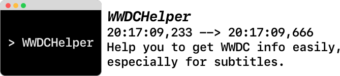

## WWDC_CL

> Inspired by [qiaoxueshi/WWDC_2015_Video_Subtitle](https://github.com/qiaoxueshi/WWDC_2015_Video_Subtitle) & [ohoachuck/wwdc-downloader](https://github.com/ohoachuck/wwdc-downloader).
> 
> Thanks for their inspiration and efforts.👏

WWDC_CL is a command line tool on macOS for you to get WWDC resources easily like subtitles in Swift.

Now you can get SD/HD video & PDF links, and download subtitles in English or **Chinese** (SRT) directly by WWDC_CL.

You can also download all the subtitles of WWDC 2017 directly in this repository, or you can also choose English or Chinese version at the [releases](https://github.com/kingcos/Learning-WWDC/releases) page.

> **Notice:**
> 
> Although I have written in Swift for years, I still have a lot to learn about Swift. And to be honest, CLI (Command Line Interface) is not familiar for me. So this program is not perfect, even a little wired. So you can issue me if you have any questions, advices or find some bugs . I will be very appreciated for your help. ❤️

### NOT Implemented

> Maybe implement in the future.

- [ ] Remove useless lines
- [ ] Clean code
- [ ] Download multiple subtitles at once
- [ ] Add spaces around English words or numbers
- [ ] Support subtitles in both English & Chinese
- [ ] Support WWDC before 2016
- [ ] Support for Linux 🐧
- [ ] Support CLI standard

### Reference

- [qiaoxueshi/WWDC_2015_Video_Subtitle](https://github.com/qiaoxueshi/WWDC_2015_Video_Subtitle)
- [ohoachuck/wwdc-downloader](https://github.com/ohoachuck/wwdc-downloader)
- [Command Line Programs on macOS Tutorial - raywenderlich.com](https://www.raywenderlich.com/163134/command-line-programs-macos-tutorial-2)
- [macOS 教程：命令行程序 - DeveloperLx/macOS_Development_Tutorials_translation](https://github.com/DeveloperLx/macOS_Development_Tutorials_translation/blob/master/Command%20Line%20Programs%20on%20macOS%20Tutorial.md)

## WWDC 17 - Notes

- [102 - Platforms State of the Union](/2017/102)

### Design

- [819 - Designing for a Global Audience](/2017/819)
- [822 - App Icon Design](/2017/822)
- [823 - Designing Glyphs](/2017/823)

## LICENSE

MIT (All rights of the resources from *Apple.com* reserved by Apple Inc.)