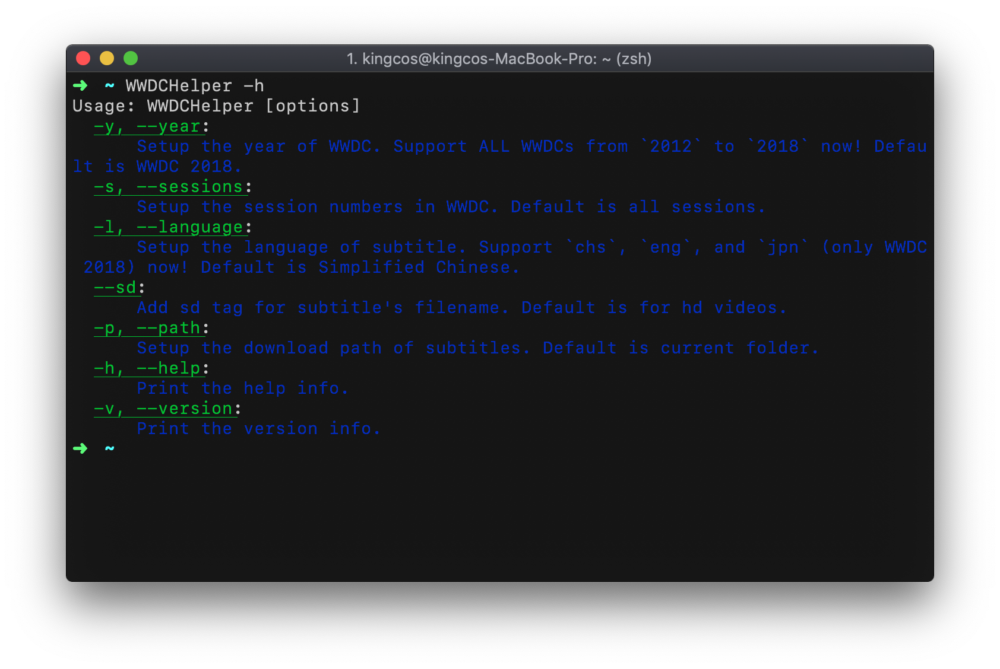

<p align="center">

</p>

<p align="center">
<a href="https://travis-ci.org/kingcos/WWDCHelper"></a>
<a href="https://codecov.io/gh/kingcos/WWDCHelper"></a>


</p>

# WWDCHelper

[English](README.md) | 中文

> 受 qiaoxueshi/WWDC_2015_Video_Subtitle，ohoachuck/wwdc-downloader，以及 @onevcat 的视频启发。感谢他们的灵感与努力。👏

[English Version README](README.md)

## 简介

WWDCHelper 是一个 macOS 命令行工具，以便于获取 WWDC 官方的资源。现在，你可以用它直接获取 SD/HD 视频和对应 PDF 文档的链接，也可以直接下载英文、日文（仅限 WWDC 2018 & 2019）、甚至**简体中文**的字幕。

当然，你也可以直接在 [releases](https://github.com/kingcos/WWDCHelper/releases) 页面仅下载字幕。

> **提示**
> 
> 虽然确实写了几年 Swift，但仍有不足，仍有差距。加上对命令行程序的不太了解，可能该项目并非很好，甚至有点怪异。如果您找到了问题、或是建议、又或是 Bug，都欢迎您提出 Issue。我会非常感谢您的帮助。❤️

## 如何使用

### 安装

您的 macOS 需要安装了 [Swift Package Manager](https://swift.org/package-manager/)，或者安装了最新版本的 Xcode 并带有命令行工具。

```sh
> git clone https://github.com/kingcos/WWDCHelper.git
> cd WWDCHelper
> ./install.sh
```

### 运行



### Demo

- *Update*: 如果您需要获取 WWDC 2019 所有 Session 信息（包括视频的下载链接）：

```sh
> wwdchelper -y 2019
```

- *Update*: 如果您需要下载 WWDC 2019 所有英文字幕（**官网最新简体中文字幕已更新至 Releases 页面**）：

```sh
# HD 视频：
> wwdchelper -y 2019 -l eng
or
# SD 视频：
> wwdchelper -y 2019 --sd -l eng
```

- 如果您仅需要 WWDC 2019 中 Session 202 和 203 的信息：

```sh
> wwdchelper -s 202 203
or
> wwdchelper -y 2019 -s 202 203
or
> wwdchelper --year 2019 --sesions 202 203
```

- 如果您想要为 Session 202 和 203 的 SD（清晰度）视频下载简体中文字幕：

```sh
> wwdchelper -s 202 203 -l chs --sd
or
> wwdchelper --year 2019 --sessions 202 203 --language chs --sd
```

- 如果您想要为**所有** Session 的 HD（清晰度）视频下载简体中文字幕，并指定路径（**不推荐**）：

```sh
> wwdchelper -l chs -p /Users/kingcos/Downloads/hd/chs/
```

### 未实现

> 可能会在未来实现以下特点：

- [x] ~~一次性下载多个字幕~~
- [x] ~~支持所有官网提供字幕~~
- [x] ~~支持所有年份 WWDC（2012～2019）~~
- [x] ~~Swift 4.1 支持~~
- [x] ~~Swift 4.2 支持~~
- [x] ~~Swift 5.0 支持~~
- [ ] 支持 Linux 🐧

### 参考

- [qiaoxueshi/WWDC_2015_Video_Subtitle](https://github.com/qiaoxueshi/WWDC_2015_Video_Subtitle)
- [ohoachuck/wwdc-downloader](https://github.com/ohoachuck/wwdc-downloader)
- [onevcat](https://github.com/onevcat)
- [onevcat/FengNiao](https://github.com/onevcat/FengNiao)

## 许可

- MIT
